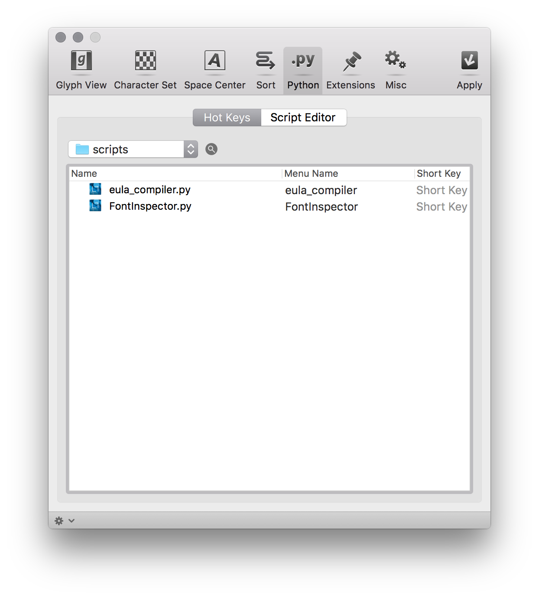
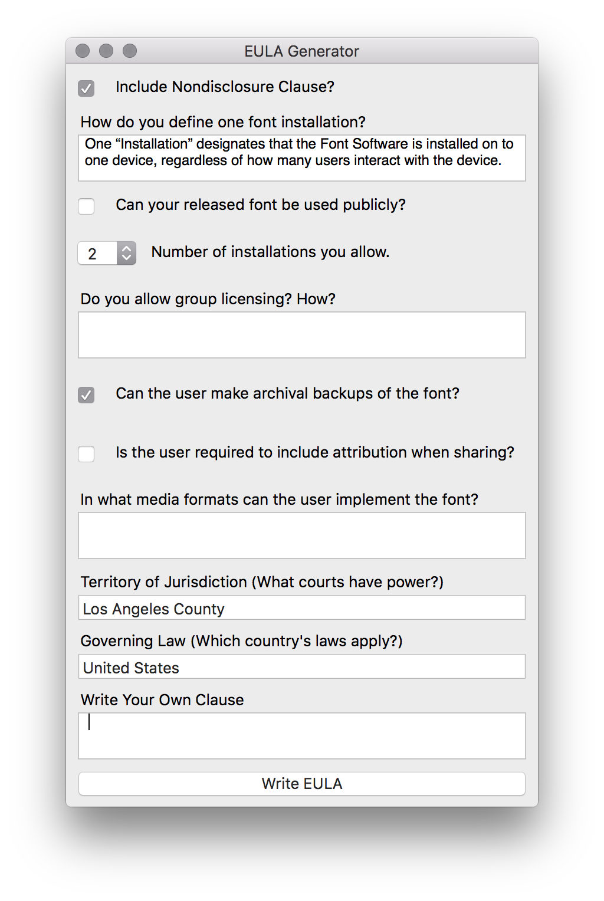

# eular
RoboFont script to generate EULAs with some parameters. 

## Installation Instructions
To install, download `eula_compiler.py` and run it through RoboFont’s Scripting Window. You can also move the document into the “scripts” folder through RoboFont’s Preferences window. 

The window allows you to toggle certain clauses, as well as write your own. 

The included EULA is a framework, and could use work. We can use your help to make it readable, mutable, and enforceable! Please email us if you have ideas. info@ghostlines.pm.

-Lukas